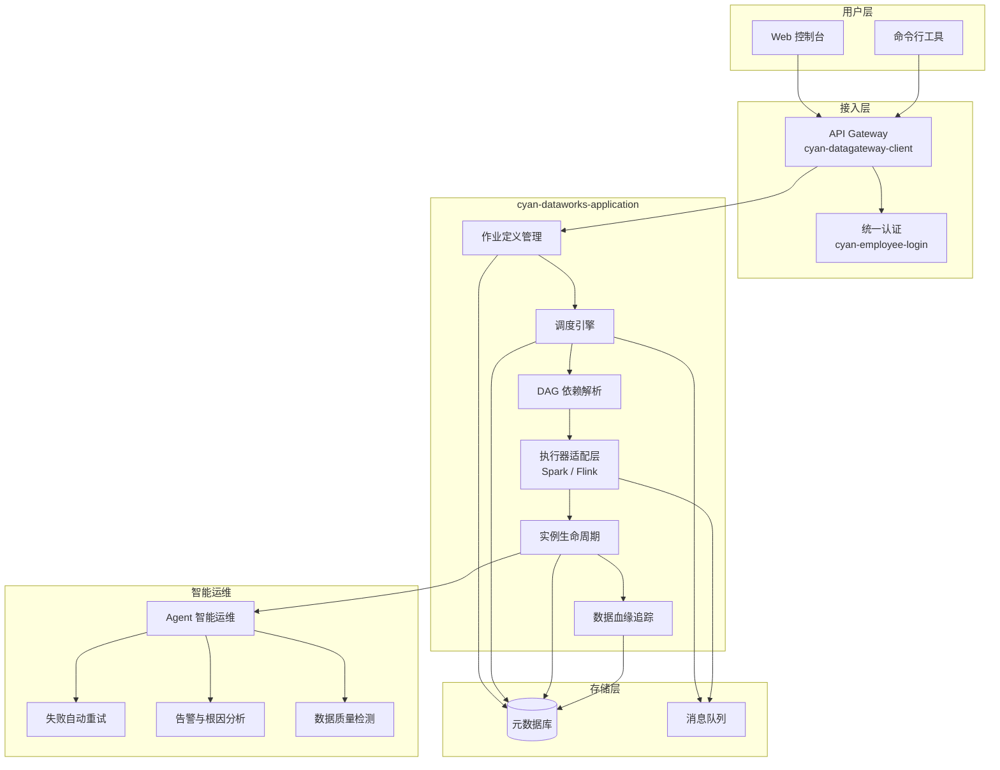

# cyan-dataworks 【规划中】

[](https://openjdk.org/projects/jdk/21/)
[](https://maven.apache.org/)
[](https://spring.io/projects/spring-boot)
[](https://baomidou.com/)
[]()

> 基于 Java 21 的分布式大数据作业编排调度系统，支持 Spark / Flink 作业的全生命周期管理。

---

## 📋 项目简介

`cyan-dataworks` 是 Cyan 体系下的**大数据作业调度与编排平台**，面向 Spark / Flink 等计算引擎，提供作业定义、调度策略、依赖管理、失败重试、数据血缘追踪及 Agent 智能运维等能力。

该项目目前处于**规划与初期建设阶段**，核心模块框架已搭建，功能持续迭代中。

---

## 🏗️ 规划架构图



---

## 📦 模块说明

| 模块 | artifactId | 说明 |
|------|-----------|------|
| **根项目** | `cyan-dataworks` | 父 POM，统一依赖管理与构建配置 |
| **应用核心** | `cyan-dataworks-application` | 调度系统主应用，包含作业定义、调度策略、实例管理、血缘追踪等核心域 |
| **客户端 SDK** | `cyan-dataworks-client` | 对外暴露的客户端 SDK，供上下游系统接入调用 |

### cyan-dataworks-application 目录结构

```
cyan-dataworks-application
├── adapter/          # 接入层：HTTP Controller、DTO、Convert
│   ├── job/
│   ├── job_instance/
│   ├── job/schedule/
│   └── task/
├── domain/           # 领域层：Entity、Repository、Query
│   ├── job/
│   ├── job_instance/
│   ├── job/schedule/
│   └── task/folder/
├── infra/            # 基础设施层：配置、持久化 DO、Mapper
│   ├── config/
│   └── persistence/
└── enums/            # 公共枚举：引擎类型、执行状态、任务状态等
```

---

## 🛠️ 技术栈

| 技术 | 版本 | 用途 |
|------|------|------|
| Java | 21 | 开发语言 |
| Maven | 3.x | 构建工具 |
| Spring Boot | 3.x | 应用框架 |
| MyBatis Plus | 3.5.7 | ORM 框架 |
| MapStruct | 1.5.5.Final | 对象映射 |
| Lombok | 1.18.42 | 代码简化 |
| cyan-arch | 1.0-SNAPSHOT | Cyan 体系基础架构 |
| cyan-employee-login | 1.0-SNAPSHOT | 统一登录认证 |
| cyan-datagateway-client | 1.0-SNAPSHOT | 数据网关客户端 |

---

## ✨ 规划功能

### 一、作业编排调度
- [ ] **多引擎支持**：Spark / Flink 作业的统一定义与提交
- [ ] **DAG 编排**：可视化/代码化 DAG 依赖编排
- [ ] **调度策略**：Cron 定时、事件触发、依赖触发
- [ ] **实例管理**：作业实例的创建、运行、终止、重试

### 二、依赖与可靠性
- [ ] **依赖管理**：上游作业完成后自动触发下游
- [ ] **失败重试**：支持配置重试次数、重试间隔、失败降级策略
- [ ] **断点续跑**：失败节点恢复后从断点继续执行

### 三、数据血缘链路
- [ ] **血缘建模**：通过依赖表和版本号记录数据血缘链路
- [ ] **影响分析**：上游变更时自动分析下游影响范围
- [ ] **血缘可视化**：提供血缘图谱查询与展示能力

### 四、Agent 智能运维
- [ ] **失败自动重跑**：基于失败模式识别，智能决策是否自动重跑
- [ ] **告警根因分析**：聚合多源日志，自动梳理告警原因
- [ ] **数据质量检测**：内置规则引擎，周期性检测数据质量并告警

---

## 🚀 快速开始

### 环境要求

- JDK 21+
- Maven 3.8+
- MySQL 8.0+

### 本地构建

```bash
# 克隆项目
git clone <repository-url>
cd cyan-dataworks

# 编译打包
mvn clean install -DskipTests

# 运行应用模块
cd cyan-dataworks-application
mvn spring-boot:run
```

### 引入客户端依赖

```xml
<dependency>
    <groupId>com.cyan</groupId>
    <artifactId>cyan-dataworks-client</artifactId>
    <version>1.0-SNAPSHOT</version>
</dependency>
```

---

## 📄 版本信息

- **当前版本**: `1.0-SNAPSHOT`
- **GroupId**: `com.cyan`
- **ArtifactId**: `cyan-dataworks`

---

> ⚠️ **注意**：本项目尚处于规划阶段，API 接口与数据模型可能随时调整，请勿用于生产环境。
